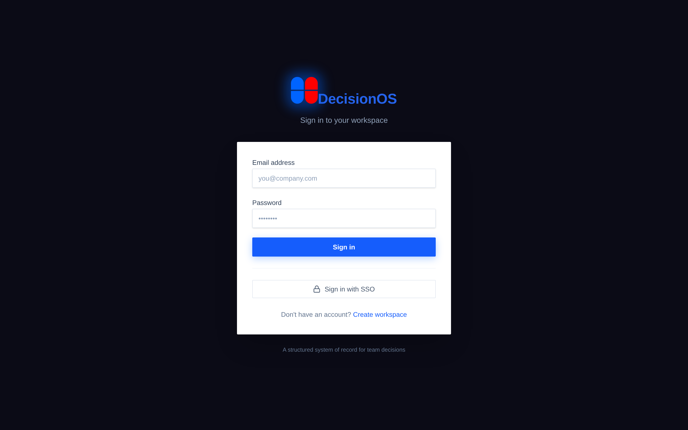
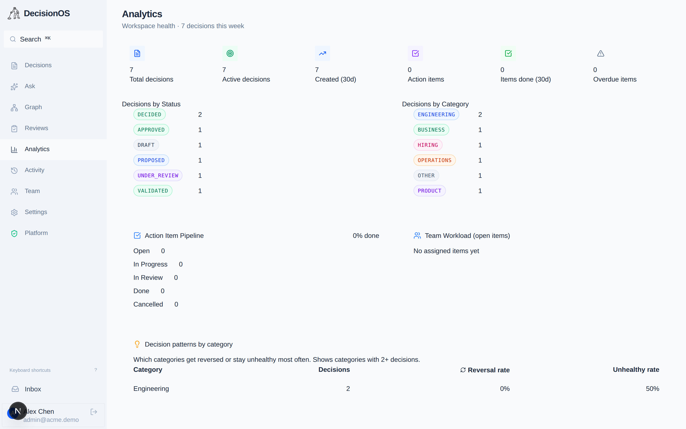
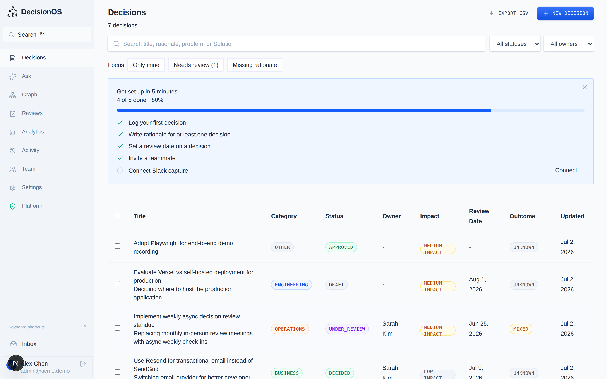
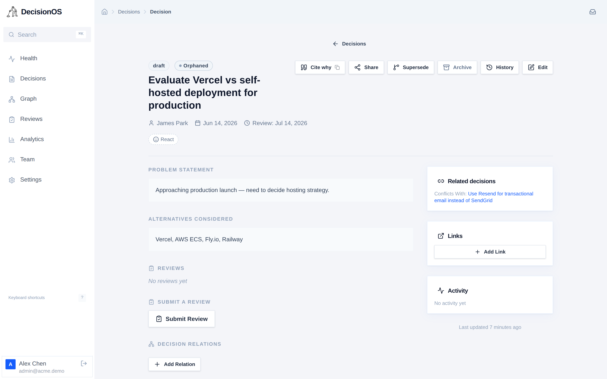
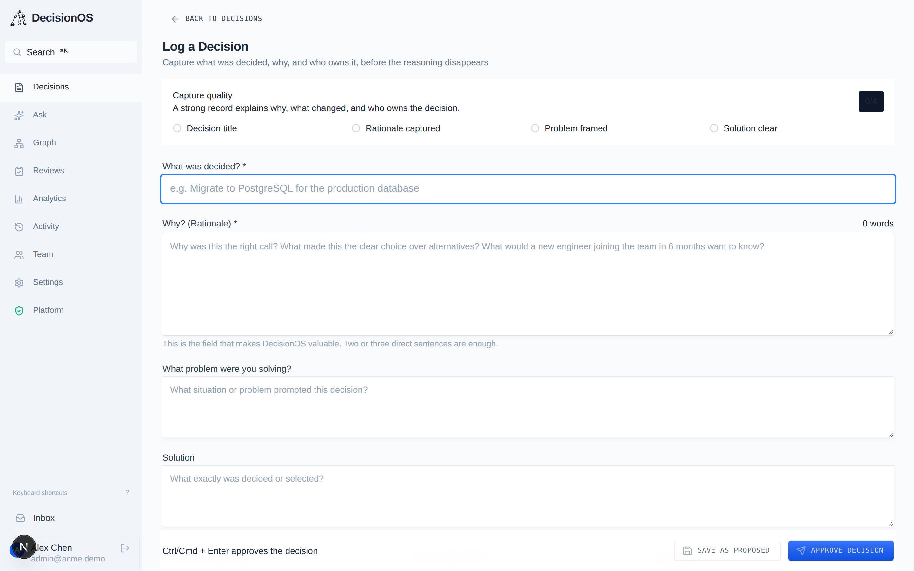
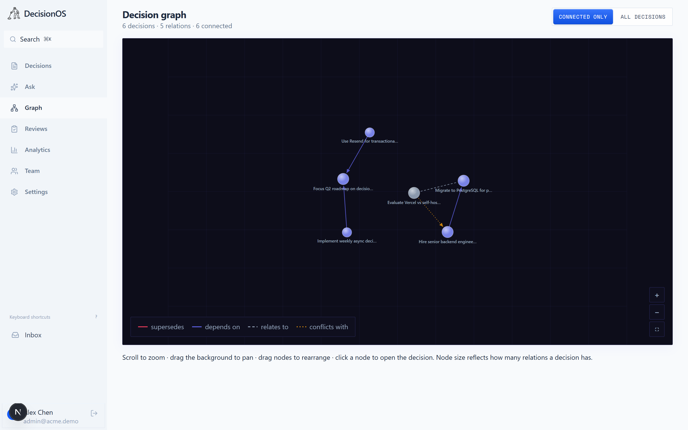

<div align="center">


<h1>DecisionOS</h1>

**The structured system of record for decisions that matter.**  
Capture what was decided, why, who decided it, alternatives considered, assumptions & risks - and whether it actually worked.

[](https://nextjs.org)
[](https://www.typescriptlang.org)
[](https://tailwindcss.com)
[](https://www.prisma.io)
[](LICENSE)

[](https://github.com/shafaypro/DecisionOS/actions/workflows/ci.yml)
[](CONTRIBUTING.md)
[](docs/deployment/README.md)
[](https://shafaypro.github.io/DecisionOS/)
[](CODE_OF_CONDUCT.md)
[](https://github.com/shafaypro/DecisionOS/stargazers)
[](https://github.com/shafaypro/DecisionOS/issues)

</div>

---

## Overview

DecisionOS is an **open-source, self-hostable decision-tracking platform** that gives teams a structured, searchable system of record for the decisions that shape their products, engineering, hiring, and strategy. It's free, MIT-licensed, and runs anywhere - no plans, no seats, no limits.

Most teams make hundreds of decisions per quarter - and forget 90% of them within a month. DecisionOS fixes that by forcing structure at the point of decision: *what* was decided, *why*, *what alternatives were ruled out*, and *what assumptions were made*. Then it closes the loop with **scheduled outcome reviews** so teams learn whether their decisions actually worked.

---

## See it in action


*25-second tour: sign in → decisions list and search → decision record → decision graph → analytics → security audit console.*

---

## Screenshots

> Captured live from a running instance with the seeded demo workspace (`admin@acme.demo`).

### Sign in


### Analytics - workspace health at a glance


### Decisions - filters, workspace memory, and focus tabs


### Decision Detail - full reasoning record


### Log a Decision - structured intake with capture-quality meter


### Decision Graph - interactive map of how decisions connect


---

## Features

| Feature | Description |
|---|---|
| **Structured Decision Records** | Title, summary, problem statement, Solution, rationale, alternatives considered, assumptions, and risks |
| **Status Workflow** | Draft → In Review → Approved → Superseded / Deprecated / Reversed / Archived |
| **Outcome Tracking** | Mark decisions as Successful / Partially Successful / Unsuccessful / Reversed / Unknown |
| **Impact Levels** | Low / Medium / High / Critical with colour-coded badges |
| **Category System** | Engineering, Product, Hiring, Finance, Marketing, Operations, Strategy, Other |
| **Outcome Reviews** | Submit periodic reviews with a rating, summary, lessons learned, and follow-up actions; full review history per decision |
| **Notes & Comments** | Add contextual notes to any decision; delete your own notes |
| **Resource Links** | Attach references (RFC, PR, ADR, article, etc.) with typed link categories |
| **Tag System** | Admins create colour-coded workspace tags; any member can apply/remove tags on decisions |
| **Advanced Filtering** | Filter by status, category, impact level, outcome, owner, or free-text search across titles |
| **Reviews Page** | Dedicated page showing overdue reviews, upcoming reviews, and review history across the workspace |
| **Dashboard Analytics** | Live stats - active decisions, due-for-review, recently reviewed, reversals; recent activity feed; high-impact decisions |
| **Public Share Page** | Generate a read-only shareable URL (`/share/:id`) for any workspace-visible decision - no login required |
| **CSV Export** | One-click export of all decisions to a dated `.csv` file with 23 columns including tags, review counts, and all reasoning fields |
| **Team Management** | Admins can invite members by email (creates an account if none exists), assign roles (Member / Admin), and view all workspace members |
| **Workspace Settings** | Admins can update the workspace name and slug |
| **Audit Log** | Every significant mutation (create, update, status change, note added, link added, reviewed) emits a `DecisionEvent` record |
| **Multi-tenant Workspaces** | Every user belongs to a workspace; all data is strictly scoped by `workspaceId` |
| **Platform Control Plane** | Provider super-admin layer above workspaces: a `/admin` console to see every company, **enter** one to manage it, and rename or suspend / reactivate it. Access is granted only via the `PLATFORM_ADMIN_EMAILS` allow-list - see [`docs/PLATFORM_ADMIN.md`](docs/PLATFORM_ADMIN.md) |
| **JWT Authentication** | Stateless, cookie-based sessions via `jose` - no third-party auth dependency |
| **Decision Graph** | Interactive force-directed canvas at `/graph` - nodes sized by relation count, edges colour-coded by type, pan/zoom/drag, hover to inspect, click to navigate |
| **Decision Health** | Per-decision health signal (healthy / overdue / stale / orphaned / superseded-unreviewed) - surfaced as a badge on every decision |
| **Blast Radius Badge** | Counts inbound `depends_on` relations - amber/rose pill warns you before you change a load-bearing decision |
| **Re-decide Detector** | Debounced similarity check while typing a new title - surfaces existing decisions to prevent accidental duplicates |
| **Version History** | Every edit snapshots the before-state; `/decisions/:id/history` shows a full field-diff timeline |
| **Emoji Reactions** | Six curated emoji reactions per decision (`👍 👎 👀 ⚠️ 🚀 ❓`) - one toggle per user per emoji |
| **Atomic Supersede** | Supersede flow wraps relation-create + status-flip + audit event in a DB transaction - no partial state |
| **Ask DecisionOS** | Natural-language Q&A over your decision log - ask *"why did we move off Auth0?"* and get an answer **grounded in and cited to the actual decision records**, with one-click jump-to-source. Falls back to ranked semantic retrieval when no AI key is configured, so it's useful on day one |
| **Command Palette** | `⌘K` / `Ctrl+K` global search with quick-capture mode - type a title, press Tab, add rationale, and log a decision without leaving the palette |
| **Keyboard Shortcuts** | Press `?` anywhere for the cheatsheet; `c` to create, `g d/h/r/a/t/s` to navigate, `Esc` to close overlays |
| **Slack Capture Bot** | `/decisionos log` slash command + 🔒 emoji trigger open a Block Kit modal - decisions log in 15 seconds from Slack |
| **Review-Due Slack DMs** | Nightly cron sends Slack DMs + emails to decision owners when reviews are overdue; weekly Monday digest email per user |
| **OIDC SSO** | OIDC/OAuth2 SSO (Okta, Google Workspace, Azure AD, Auth0) - auto-provisions users on first login |
| **Decision Templates** | Five built-in templates (Engineering ADR, Hiring Rubric, Product RFC, Business Go/No-Go, Operations Process) pre-fill the decision form |
| **Analytics** | Decision patterns by category - reversal rate and unhealthy rate per category, no third-party tracker |
| **Demo Seed** | One-request `/api/seed` endpoint populates a full demo workspace with decisions, reviews, notes, tags, and links |

---

## Tech Stack

```
Frontend          Next.js 16.2 (App Router) · React 19 · TypeScript 5
Styling           Tailwind CSS v4 · Radix UI primitives · class-variance-authority
Data Layer        Prisma v7 · @prisma/adapter-libsql · SQLite (libsql)
Auth              Custom JWT sessions (jose) · HttpOnly cookies
Forms             React 19 (useState + useTransition + fetch) · REST API routes
Utilities         date-fns · lucide-react · clsx · tailwind-merge · bcryptjs
```

### Key architectural decisions

- **Prisma v7** uses a mandatory driver adapter. We use `@prisma/adapter-libsql` with a local SQLite file in development. The generated TypeScript client lives in `src/generated/prisma/` (not `node_modules/@prisma/client`).
- **Next.js 16 proxy** replaces the classic `middleware.ts` convention. The auth guard lives in `src/proxy.ts` and exports a `proxy` function (not `middleware`).
- **REST API routes for all mutations** - all state-changing operations go through `src/app/api/` route handlers called via `fetch()` from client components. This sidesteps a Turbopack 16.2.x bug where sharing a layout that contains a server action causes all action dispatches on child pages to be misrouted to the layout's action instead of the intended one.
- **No next-auth** - authentication is a thin custom JWT layer in `src/lib/session.ts`. Sessions are encrypted with `jose` (`EncryptJWT` / `A256GCM`) and stored in a `session` HttpOnly cookie. This keeps full control over the session payload (userId, workspaceId, role, email, name) without any external dependency.
- **Workspace-scoped everything** - every Prisma query in API routes checks `workspaceId === session.workspaceId` before returning or mutating data. There is no cross-workspace data leakage by design.

---

## Project Structure

> The tree below shows the core layout. Many features have been added since the initial build (Slack, SSO, graph, analytics, etc.) - see [`docs/SETUP.md`](docs/SETUP.md) for the full module breakdown.

```
DecisionOS/
├── prisma/
│   ├── schema.prisma               # Full data model (25 models)
│   ├── seed.ts                     # Demo workspace seeder
│   └── migrations/                 # Postgres migration history
├── prisma.config.ts                # Prisma v7 config (DATABASE_URL, adapter, migrations path)
├── src/
│   ├── actions/                    # Legacy server actions (auth only; all mutations now in api/)
│   │   ├── auth.ts                 # signup, login, logout (still server actions - outside app layout)
│   │   ├── decisions.ts            # (kept for reference; superseded by api/decisions/)
│   │   ├── team.ts                 # (superseded by api/team/)
│   │   ├── settings.ts             # (superseded by api/settings/)
│   │   └── tags.ts                 # (superseded by api/tags/)
│   ├── app/
│   │   ├── (app)/                  # Protected routes - require valid session
│   │   │   ├── layout.tsx          # App shell - session guard + Sidebar
│   │   │   ├── dashboard/          # Stats cards + recent activity feed
│   │   │   ├── decisions/
│   │   │   │   ├── page.tsx        # Searchable, filterable decisions list
│   │   │   │   ├── decisions-filter.tsx  # Client-side filter bar (URL params)
│   │   │   │   ├── new/page.tsx    # Create decision form
│   │   │   │   └── [id]/
│   │   │   │       ├── page.tsx          # Decision detail - full record view
│   │   │   │       ├── edit/page.tsx     # Edit decision form
│   │   │   │       ├── note-form.tsx     # Add note (fetch → /api/decisions/notes)
│   │   │   │       ├── link-form.tsx     # Add link (fetch → /api/decisions/links)
│   │   │   │       ├── review-form.tsx   # Submit review (fetch → /api/decisions/reviews)
│   │   │   │       ├── delete-note-button.tsx
│   │   │   │       ├── delete-link-button.tsx
│   │   │   │       ├── archive-button.tsx
│   │   │   │       ├── tag-manager.tsx   # Apply/remove tags inline
│   │   │   │       └── share-button.tsx  # Copy /share/:id URL to clipboard
│   │   │   ├── reviews/            # Workspace-wide review tracking
│   │   │   ├── tags/               # Tag management (admin: create/delete)
│   │   │   ├── team/               # Member list + invite form
│   │   │   └── settings/           # Workspace name / slug
│   │   ├── login/                  # Public - login form (server action safe; no app layout)
│   │   ├── signup/                 # Public - signup + workspace creation
│   │   ├── share/[id]/             # Public - read-only decision share page (no auth)
│   │   └── api/
│   │       ├── seed/route.ts       # GET  - populate demo data
│   │       ├── decisions/
│   │       │   ├── route.ts        # POST - create decision
│   │       │   ├── [id]/route.ts   # PUT  - update decision
│   │       │   ├── notes/route.ts  # POST / DELETE - notes
│   │       │   ├── links/route.ts  # POST / DELETE - resource links
│   │       │   ├── reviews/route.ts# POST - submit outcome review
│   │       │   ├── archive/route.ts# POST - archive decision
│   │       │   ├── tags/route.ts   # POST / DELETE - tag assignment
│   │       │   └── export/route.ts # GET  - CSV download
│   │       ├── tags/route.ts       # POST / DELETE - workspace tag CRUD (admin)
│   │       ├── team/route.ts       # POST - invite member
│   │       └── settings/route.ts   # PUT  - update workspace
│   ├── components/
│   │   ├── decisions/
│   │   │   ├── decision-form.tsx   # Full create/edit form (self-contained, fetch-based)
│   │   │   └── status-badge.tsx    # StatusBadge, OutcomeBadge, ImpactBadge, CategoryBadge
│   │   ├── layout/
│   │   │   └── sidebar.tsx         # Nav sidebar with workspace name + logout
│   │   └── ui/                     # Radix-based primitives: Button, Card, Input, Label,
│   │                               #   Textarea, Badge, Select, Separator
│   ├── lib/
│   │   ├── prisma.ts               # PrismaClient singleton (libsql adapter)
│   │   ├── session.ts              # JWT create / get / delete (jose, HttpOnly cookie)
│   │   └── utils.ts                # CATEGORIES, STATUSES, IMPACT_LEVELS, OUTCOME_STATUSES,
│   │                               #   LINK_TYPES, cn(), formatDate(), formatRelativeDate(), slugify()
│   └── proxy.ts                    # Route protection (Next.js 16 middleware replacement)
├── tests/                          # smoke/ (zero-dep runner) + integration/ (Vitest)
├── docs/                           # Setup, architecture, deployment, compliance (published via MkDocs)
├── deploy/                         # Terraform + Compose for EC2, GCP, ECS, Kubernetes
├── scripts/                        # dev-db.mjs - zero-config local SQLite bootstrap
├── .github/                        # CI workflows, issue/PR templates, Dependabot, CODEOWNERS
├── Dockerfile                      # Multi-stage build: slim runner + one-shot migrator
├── docker-compose.yml              # Local dev infra (Postgres + Redis); prod stack lives in deploy/
├── .env.example                    # Environment template (copy to .env)
└── tsconfig.json
```

---

## Data Model

### Entity Relationship Summary

```
Workspace  ──< WorkspaceMembership >── User
           ──< Decision
                  ──< DecisionNote       (userId → User)
                  ──< DecisionLink       (createdByUserId → User)
                  ──< DecisionReview     (reviewedByUserId → User)
                  ──< DecisionTag >── Tag (workspaceId → Workspace)
                  ──< DecisionEvent      (userId → User, audit log)
```

### Workspace fields (selected)

| Field | Type | Description |
|---|---|---|
| `status` | String | `active` / `suspended` - lifecycle set by the platform console; suspended workspaces lock out their members (see [`docs/PLATFORM_ADMIN.md`](docs/PLATFORM_ADMIN.md)) |

### Decision fields

| Field | Type | Description |
|---|---|---|
| `title` | String | Short decision title (3-200 chars) |
| `summary` | String| 1-2 sentence description shown in list views (max 500) |
| `category` | String | `engineering` / `product` / `hiring` / `finance` / `marketing` / `operations` / `strategy` / `other` |
| `status` | String | `draft` / `in_review` / `approved` / `superseded` / `deprecated` / `reversed` / `archived` |
| `outcomeStatus` | String| `unknown` / `successful` / `partially_successful` / `unsuccessful` / `reversed` |
| `impactLevel` | String | `low` / `medium` / `high` / `critical` |
| `visibility` | String | `workspace` (all members) / `private` (creator only) |
| `ownerUserId` | String| Responsible person (FK → User) |
| `problemStatement` | String| What problem prompted this decision? |
| `chosenOption` | String| What specific option was selected? |
| `rationale` | String| Why was this option chosen? |
| `alternativesConsidered` | String| What other options were evaluated? |
| `assumptions` | String| Conditions that must hold for this to work |
| `risks` | String| Known failure modes and downsides |
| `decisionDate` | DateTime | When the decision was made |
| `reviewDate` | DateTime | When to revisit the decision |
| `reviewedAt` | DateTime | When the first review was submitted |

### Tag fields

| Field | Type | Description |
|---|---|---|
| `name` | String | Tag label (unique per workspace, max 50 chars) |
| `color` | String| Hex colour (e.g. `#6366f1`) used for badge rendering |

### DecisionReview fields

| Field | Type | Description |
|---|---|---|
| `outcomeStatus` | String | `successful` / `partially_successful` / `unsuccessful` / `reversed` |
| `summary` | String| What actually happened |
| `lessonsLearned` | String| What would you do differently? |
| `followUpAction` | String| Follow-on decisions or actions required |

### DecisionEvent types (audit log)

`created` · `updated` · `status_changed` · `note_added` · `link_added` · `reviewed`

---

## REST API Reference

All routes require a valid session cookie (`session`) except `/api/seed` and the public share page.

### Decisions

| Method | Route | Auth | Body / Params | Description |
|---|---|---|---|---|
| `POST` | `/api/decisions` | member | Decision fields (JSON) | Create a new decision |
| `PUT` | `/api/decisions/:id` | member | Decision fields (JSON) | Update an existing decision |
| `POST` | `/api/decisions/archive` | owner or admin | `{ decisionId }` | Archive a decision (sets status = `Archived`) |
| `POST` | `/api/decisions/ask` | any member | `{ question }` | Ask a natural-language question; returns a grounded, cited answer + ranked source decisions (degrades to semantic search with no AI key) |
| `GET` | `/api/decisions/export` | member | - | Download all workspace decisions as CSV |

### Notes

| Method | Route | Auth | Body | Description |
|---|---|---|---|---|
| `POST` | `/api/decisions/notes` | member | `{ decisionId, content }` | Add a note to a decision |
| `DELETE` | `/api/decisions/notes` | owner or admin | `{ noteId }` | Delete a note |

### Links

| Method | Route | Auth | Body | Description |
|---|---|---|---|---|
| `POST` | `/api/decisions/links` | member | `{ decisionId, label, url, linkType }` | Add a resource link |
| `DELETE` | `/api/decisions/links` | owner or admin | `{ linkId }` | Remove a link |

Link types: `rfc` · `pr` · `adr` · `doc` · `article` · `ticket` · `other`

### Reviews

| Method | Route | Auth | Body | Description |
|---|---|---|---|---|
| `POST` | `/api/decisions/reviews` | member | `{ decisionId, outcomeStatus, summary?, lessonsLearned?, followUpAction? }` | Submit an outcome review |

### Tags

| Method | Route | Auth | Body | Description |
|---|---|---|---|---|
| `POST` | `/api/tags` | **admin** | `{ name, color? }` | Create a workspace tag |
| `DELETE` | `/api/tags` | **admin** | `{ tagId }` | Delete a workspace tag |
| `POST` | `/api/decisions/tags` | member | `{ decisionId, tagId }` | Apply a tag to a decision |
| `DELETE` | `/api/decisions/tags` | member | `{ decisionId, tagId }` | Remove a tag from a decision |

### Team & Settings

| Method | Route | Auth | Body | Description |
|---|---|---|---|---|
| `POST` | `/api/team` | **admin** | `{ email, role }` | Invite a member (creates user if none exists) |
| `PUT` | `/api/settings` | **admin** | `{ name, slug }` | Update workspace name and URL slug |

### Platform (provider)

Staff-only routes for the platform control plane - gated by `withPlatformApi` (401 if
unauthenticated, 403 without `platformRole`). Intentionally **not** scoped to a single workspace.
See [`docs/PLATFORM_ADMIN.md`](docs/PLATFORM_ADMIN.md).

| Method | Route | Auth | Body | Description |
|---|---|---|---|---|
| `GET` | `/api/platform/workspaces` | **platform** | - | List every company with status and member/decision counts |
| `POST` | `/api/platform/workspaces/:id/enter` | **platform** | - | Enter a company (re-issues the session at that workspace) |
| `POST` | `/api/platform/exit` | **platform** | - | Stop impersonating; return to your home workspace |
| `PATCH` | `/api/platform/workspaces/:id` | **platform** | `{ name?, slug?, status? }` | Rename and/or suspend / reactivate a company |

### Utilities

| Method | Route | Auth | Description |
|---|---|---|---|
| `GET` | `/api/seed` | - | Seed demo workspace (idempotent) |

---

## Authentication Flow

```
POST /login  (server action)
  → bcrypt.compare(password, user.passwordHash)
  → createSession({ userId, workspaceId, role, email, name })
      → jose.EncryptJWT(...).encrypt(SESSION_SECRET)
      → Set-Cookie: session=<jwt>; HttpOnly; SameSite=Lax; Path=/

Every request
  → proxy.ts intercepts
  → decrypt(cookie) → if no valid session → redirect /login
  → if session + public route → redirect /dashboard

API routes
  → getSession() → decrypt cookie → return session payload
  → check session.workspaceId matches resource's workspaceId
```

Session payload shape:
```ts
{
  userId: string
  workspaceId: string
  role: "admin" | "member" | "viewer"
  email: string
  name: string
  // Platform control plane - present only for provider staff (see docs/PLATFORM_ADMIN.md)
  platformRole?: "superadmin"      // sourced from PLATFORM_ADMIN_EMAILS at login; never DB-granted
  platformHomeWorkspaceId?: string // the admin's own workspace - the way back from impersonation
}
```

---

## Getting Started

> **Full step-by-step setup** - including Slack bot install, OIDC SSO, email providers, Vercel Cron, and deploy - lives in [`docs/SETUP.md`](docs/SETUP.md). The quickstart below is just enough to run locally.

### Prerequisites

- Node.js 20+
- npm 10+

### Installation

```bash
git clone https://github.com/shafaypro/DecisionOS.git
cd DecisionOS
npm install
```

### Environment setup

Create a `.env` file in the project root:

```env
DATABASE_URL="file:./dev.db"
SESSION_SECRET="change-this-to-a-long-random-secret-in-production"
```

> **Production note:** Generate a strong `SESSION_SECRET` with `openssl rand -base64 32`. The secret is used to sign and encrypt JWT session cookies.

### Deployment

DecisionOS ships with Terraform/Compose for several targets (single EC2, GCP free-tier, AWS ECS, Kubernetes, or plain Docker Compose). **CI/CD runs on GitHub Actions**: PRs are gated by `ci.yml` (type-check, lint, smoke + integration tests, build), and `release-images.yml` publishes container images to **GHCR** when you publish a release - your host just pulls them.

- **[Architecture diagram + guide](docs/deployment/ARCHITECTURE.md)** - the whole system in one view.
- **[Deployment guide](docs/deployment/README.md)** - compare the targets and pick one.
- **[AWS EC2 runbook](docs/deployment/AWS_EC2_DEPLOYMENT_RUNBOOK.md)** - self-host on a single box, step by step.
- **[GCP free-tier](docs/deployment/GCP.md)** - the Google Cloud alternative.

The full documentation map is at **[`docs/`](docs/README.md)**.

### Database setup

**Local dev needs no manual database steps.** The committed schema targets
PostgreSQL (all migrations are Postgres-dialect), so `prisma migrate dev` against
the default SQLite `dev.db` would fail on a provider mismatch. Instead, `npm run
dev` runs a `predev` hook (`scripts/dev-db.mjs`) that derives a SQLite-flavored
schema, generates the client, and syncs `dev.db` for you.

```bash
# Just start the dev server - the SQLite dev database is set up automatically.
npm run dev

# Optional: browse the local data (point Studio at the derived SQLite schema).
npx prisma studio --schema prisma/dev-sqlite.prisma
```

Prefer Postgres locally? Set a `postgres://` `DATABASE_URL` (e.g. `docker compose
up -d`); then the committed schema and `npx prisma migrate dev` apply directly.

### Seed demo data

Start the dev server first, then hit the seed endpoint once:

```bash
npm run dev
curl http://localhost:3001/api/seed
```

This creates:
- A demo workspace (`Acme Demo`)
- 3 users (admin + 2 members)
- 6 decisions across categories with full reasoning content
- Sample notes, links, tags, and an outcome review

### Run the dev server

```bash
npm run dev
```

Open [http://localhost:3001](http://localhost:3001) (port 3001 is the default in this project's config).

---

## Demo

DecisionOS is free and open source - spin up the full app locally in ~2 minutes (see [Getting Started](#getting-started)), seed realistic demo data, and sign in. No signup limits, no credit card, nothing to unlock.

```bash
npm install && npm run dev      # http://localhost:3001
curl http://localhost:3001/api/seed   # in another terminal - loads the demo workspace
```

After seeding (`GET /api/seed`), sign in with:

| Role | Email | Password |
|---|---|---|
| Admin | `admin@acme.demo` | `password123` |
| Member | `sarah@acme.demo` | `password123` |
| Member | `james@acme.demo` | `password123` |

The admin account has full access to tag management, team invitations, workspace settings, and can delete any note or link regardless of author.

---

## Available Scripts

```bash
npm run dev          # Start development server (Turbopack, port 3001)
npm run build        # Production build
npm run start        # Start production server
npm run lint         # ESLint check
npm run test:smoke   # Run zero-dep smoke tests (22 suites: Slack HMAC, crypto, rate limiter, decision health, similarity, graph layout, auth guards, utils, review token, decision retrieval, session, api foundation, workspace summary, cron auth, error reporting, platform auth, audit, csv, schemas, observability, activity events, notify)
npm run test:integration  # Vitest - real route handlers vs DB (tenant isolation, visibility, authz)
npm test             # Smoke + integration
npx tsc --noEmit     # TypeScript type check (no emit)
npx prisma migrate dev          # Apply pending migrations
npx prisma studio               # Open Prisma Studio GUI
npx prisma db push              # Push schema changes without migration files (dev only)
npx prisma migrate reset        # Drop + recreate DB (destructive)
```

---

## Key Pages

| Route | Description |
|---|---|
| `/dashboard` | Workspace health - decision debt pill, stats cards, recent activity feed, overdue reviews |
| `/decisions` | Full decision list with search, multi-filter sidebar, and onboarding checklist |
| `/decisions/new` | Create a new decision - full structured form with template picker and re-decide detector |
| `/decisions/:id` | Decision detail - all fields, health badge, blast radius, reactions, notes, links, tags, version history, reviews, audit trail |
| `/decisions/:id/edit` | Edit all decision fields (snapshots a version before saving) |
| `/decisions/:id/history` | Full field-diff timeline - before/after for every edit |
| `/board` | Kanban board - decisions grouped by status, with per-card move/delete actions |
| `/my-work` | Everything assigned to or owned by you - decisions and action items in one place |
| `/activity` | Workspace activity feed with event-type filtering |
| `/ask` | **Ask DecisionOS** - ask your decision history in plain English; grounded, cited answers with clickable sources |
| `/graph` | Interactive decision graph - force-directed canvas with pan/zoom/drag and edge-type legend |
| `/reviews` | Workspace-wide reviews hub - overdue, upcoming, recent |
| `/analytics` | Decision patterns by category - reversal rate and health rate per category |
| `/tags` | Tag management (admins create/delete; all members apply) |
| `/team` | Member roster + invite form (admin) |
| `/settings` | Workspace name and slug settings (admin) |
| `/settings/templates` | Decision template management - create/edit reusable intake templates (admin) |
| `/settings/audit` | Workspace security audit log viewer - immutable, filterable trail |
| `/settings/sso` | OIDC SSO configuration - issuer, client ID/secret, email domain, enforce SSO |
| `/settings/integrations` | Slack install, Anthropic API key, per-workspace integration config |
| `/admin` | **Platform staff only** - provider console listing every company; enter, rename, or suspend / reactivate a workspace (see [`docs/PLATFORM_ADMIN.md`](docs/PLATFORM_ADMIN.md)) |
| `/share/:id` | **Public** read-only view of a workspace-visible decision - no login required |
| `/api/decisions/export` | Triggers CSV file download of all workspace decisions |

---

## Turbopack Compatibility Note

This project targets **Next.js 16.2.x** which ships Turbopack as the default bundler. Turbopack 16.2.x has a known bug: when a shared layout (e.g. the app shell containing the `logout` button) registers a server action, Turbopack can misroute all subsequent server action dispatches on child pages to the layout's action ID instead of the intended action ID.

**Workaround applied in this codebase:** All mutations inside the `(app)` layout tree use plain `fetch()` calls to REST API route handlers (`src/app/api/`). The only remaining server action in the `(app)` layout is `logout` in the sidebar - it is now the *only* action in the tree, eliminating the ID collision. Login and signup pages are outside the `(app)` layout and remain unaffected.

---

## Roadmap

- [x] Structured decision records with full reasoning fields
- [x] Status workflow + outcome tracking
- [x] Outcome reviews with lessons learned
- [x] Notes and resource links
- [x] Tag system (admin-managed, member-applied)
- [x] Advanced filtering by status, category, impact, outcome, owner
- [x] Dashboard analytics
- [x] Public read-only share page
- [x] CSV export
- [x] Team management + invite
- [x] Audit log / decision event history
- [x] Decision graph - interactive force-directed map of how decisions relate, supersede, or conflict
- [x] Slack capture bot + email review reminders + Monday weekly digest
- [x] Decision templates by category (Engineering ADR, Hiring rubric, Product RFC, etc.)
- [x] PostgreSQL support for production deployments
- [x] Decision versioning - full field diff history with before/after timeline
- [x] AI-assisted decision drafting (Anthropic integration, per-workspace key)
- [x] Ask DecisionOS - grounded, cited natural-language Q&A over the decision log (graceful semantic-search fallback)
- [x] Platform control plane - provider super-admin console to manage all companies (enter / rename / suspend / reactivate)
- [x] Viewer role (read-only access below Member)
- [x] Bulk actions (archive multiple decisions, bulk-export filtered results)
- [x] Kanban board, My Work, activity feed, in-app notifications, and decision watching
- [ ] Comment threads on notes (replies) - API and data model are in place; detail-page UI is not yet wired up

---

## Documentation

Browse the full docs site at **[shafaypro.github.io/DecisionOS](https://shafaypro.github.io/DecisionOS/)** (built from [`docs/`](docs/README.md) with MkDocs). Highlights:

| Area | Start here |
|---|---|
| Setup (Slack, SSO, email, cron) | [docs/SETUP.md](docs/SETUP.md) |
| Architecture (system + code) | [docs/deployment/ARCHITECTURE.md](docs/deployment/ARCHITECTURE.md), [docs/architecture/](docs/architecture/README.md) |
| Deployment + CI/CD | [docs/deployment/](docs/deployment/README.md) |
| Platform admin console | [docs/PLATFORM_ADMIN.md](docs/PLATFORM_ADMIN.md) |
| GDPR / data protection | [docs/compliance/GDPR.md](docs/compliance/GDPR.md) |
| SOC 2 control mapping | [docs/compliance/SOC2.md](docs/compliance/SOC2.md) |
| All docs (index) | [docs/README.md](docs/README.md) |

---

## Contributing

Contributions are welcome and appreciated 💙 - whether it's a bug report, a docs fix, or a feature. For major changes, please [open an issue](https://github.com/shafaypro/DecisionOS/issues/new/choose) first to discuss the approach.

1. Fork the repo and create a feature branch (`git checkout -b feature/my-feature`)
2. Make your changes
3. Run the checks - **all three must pass**:
   ```bash
   npx tsc --noEmit    # type-check
   npm run lint         # eslint
   npm run test:smoke   # zero-dep smoke suite (add one for new pure logic)
   ```
4. Commit ([Conventional Commits](https://www.conventionalcommits.org/)), push, and open a PR targeting `main`

New here? Look for [**good first issue**](https://github.com/shafaypro/DecisionOS/labels/good%20first%20issue) labels. See the full guide in **[CONTRIBUTING.md](CONTRIBUTING.md)**.

### Community

- 📓 [**CONTRIBUTING.md**](CONTRIBUTING.md) - local setup, conventions, architecture constraints
- 🤝 [**Code of Conduct**](CODE_OF_CONDUCT.md) - the standards we hold each other to
- 🔒 [**Security policy**](SECURITY.md) - how to report a vulnerability privately
- 🐛 [Report a bug](https://github.com/shafaypro/DecisionOS/issues/new?template=bug_report.yml) · 💡 [Request a feature](https://github.com/shafaypro/DecisionOS/issues/new?template=feature_request.yml)

---

## License

MIT © [shafaypro](https://github.com/shafaypro)

---

<div align="center">
  <sub>Built with Next.js 16 · Prisma v7 · Tailwind CSS v4 · React 19 · SQLite (libsql)</sub>
</div>
