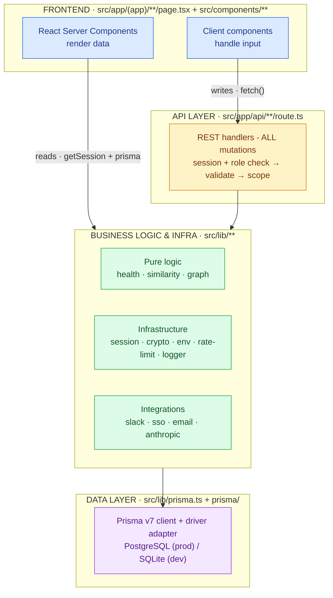
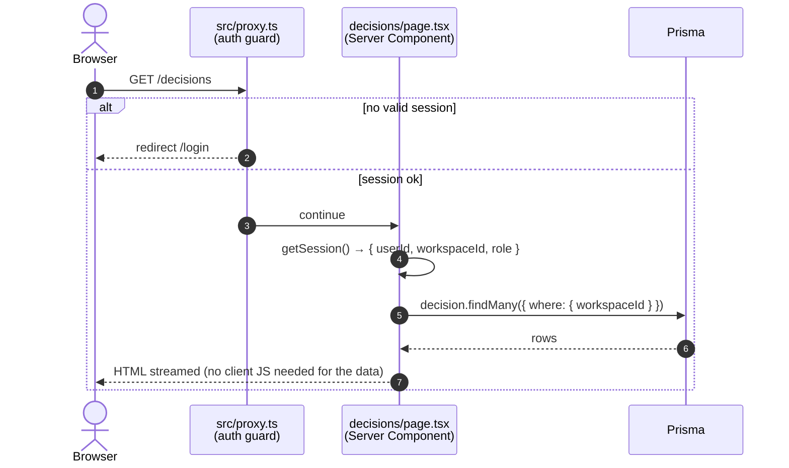
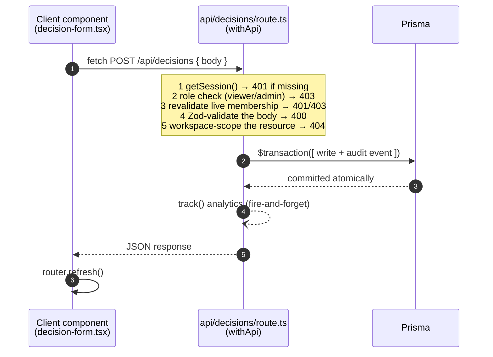
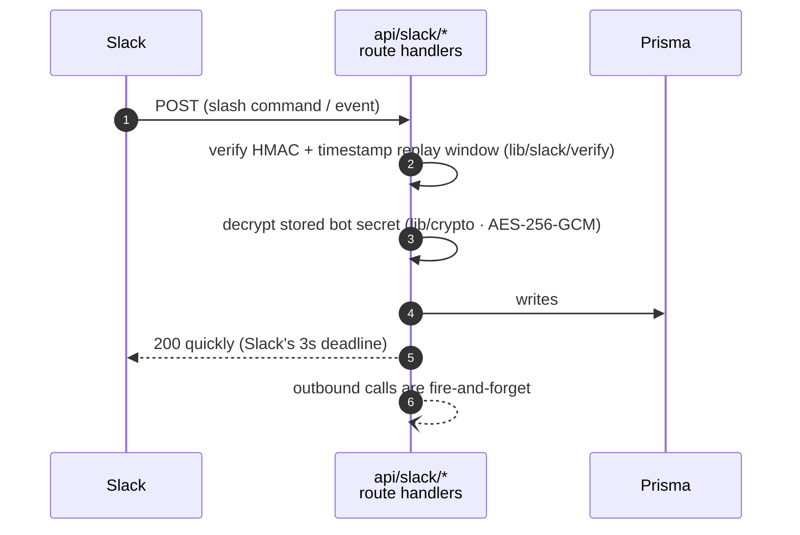
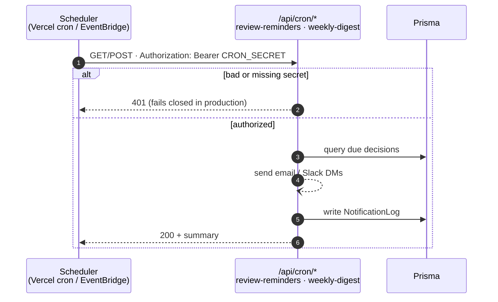
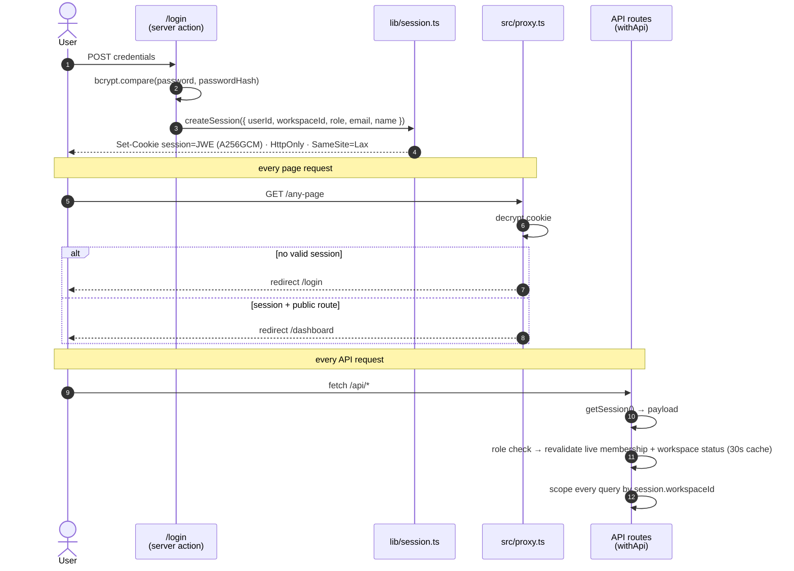

# DecisionOS Architecture

How the codebase is organized **by layer**, and how a request flows through them.
Each layer has its own deep-dive:

| Layer | Doc | Lives in |
|---|---|---|
| Frontend (pages + components) | [frontend-layer.md](frontend-layer.md) | `src/app/(app)`, `src/components` |
| API (route handlers) | [api-layer.md](api-layer.md) | `src/app/api` |
| Business logic & infrastructure | [business-logic-layer.md](business-logic-layer.md) | `src/lib`, `src/actions` |
| Data (Prisma + DB) | [data-layer.md](data-layer.md) | `src/lib/prisma.ts`, `prisma/` |

For deployment/infra architecture (AWS ECS), see [`deploy/aws-ecs/docs/`](https://github.com/shafaypro/DecisionOS/blob/main/deploy/aws-ecs/docs/ARCHITECTURE.md).

---

## The layered model



**The golden rule (enforced by a real Turbopack bug):** state-changing work goes
through the **API layer**, never server actions inside `src/app/(app)/`. The only
server actions are auth (`src/actions/auth.ts`), which live outside the app layout.
See [CONTRIBUTING.md → Architecture constraints](https://github.com/shafaypro/DecisionOS/blob/main/CONTRIBUTING.md#4-architecture-constraints).

---

## End-to-end request flows

### A. Loading a protected page (read path)



The guard is `src/proxy.ts` - the Next.js 16 convention, **not** `middleware.ts`.

### B. Creating / changing data (write path)



### C. Inbound webhook / integration (no user session)



### D. Scheduled job



On Vercel: `vercel.json` crons. On ECS: EventBridge (`deploy/aws-ecs/optional-scheduled-jobs.tf`).

---

## Cross-cutting concerns

| Concern | Where | Notes |
|---|---|---|
| **Auth guard** | `src/proxy.ts` | Next 16 convention; gates protected routes, allows `/login`, `/signup`, `/`, `/pricing`, `/share`. |
| **Sessions** | `src/lib/session.ts` | Encrypted JWE (jose, `dir` + A256GCM) in an httpOnly cookie; 7-day expiry. API routes also revalidate live membership + workspace status per request (`src/lib/access-control.ts`). |
| **Authorization** | `src/lib/auth-guards.ts` | `isViewer` / `canWrite` / `isAdmin` helpers used per route. |
| **Platform authorization** | `src/lib/platform-authorize.ts`, `src/lib/platform-api-handler.ts` | Provider control plane - a **separate axis** from the workspace role. `isPlatformAdmin` / `authorizePlatform` / `withPlatformApi` gate the `(platform)/admin` console + `/api/platform/*` (staff from `PLATFORM_ADMIN_EMAILS`). Does **not** touch `workspaceWhere()` - tenant isolation is unchanged. See [PLATFORM_ADMIN.md](../PLATFORM_ADMIN.md). |
| **Config & secrets** | `src/lib/env.ts` | Single validated source; `SESSION_SECRET`/`DATABASE_URL` required in prod. |
| **Encryption at rest** | `src/lib/crypto.ts` | AES-256-GCM for stored Slack/SSO secrets; per-record salt. |
| **Rate limiting** | `src/lib/rate-limit.ts` | Redis-backed (multi-instance) with in-memory fallback. |
| **Logging** | `src/lib/logger.ts` | Structured JSON in prod for cloud log aggregation. |
| **Analytics** | `src/lib/analytics.ts` | First-party events to the DB; fire-and-forget. |
| **Workspace isolation** | every API route | Resources are filtered by `session.workspaceId`; cross-workspace access → 404. Platform-admin "enter company" works *within* this rule by swapping `session.workspaceId`, not by bypassing the filter. |

## Authentication flow



Session payload shape:

```ts
{
  userId: string
  workspaceId: string
  role: "admin" | "member" | "viewer"
  email: string
  name: string
  // Platform control plane - present only for provider staff (see PLATFORM_ADMIN.md)
  platformRole?: "superadmin"      // sourced from PLATFORM_ADMIN_EMAILS at login; never DB-granted
  platformHomeWorkspaceId?: string // the admin's own workspace - the way back from impersonation
}
```

## Tech stack

Next.js 16 (App Router, Turbopack) · React 19 · TypeScript (strict) · Tailwind v4 ·
Prisma v7 (driver adapters) · PostgreSQL (prod) · jose (JWT) · bcryptjs · Radix UI.
