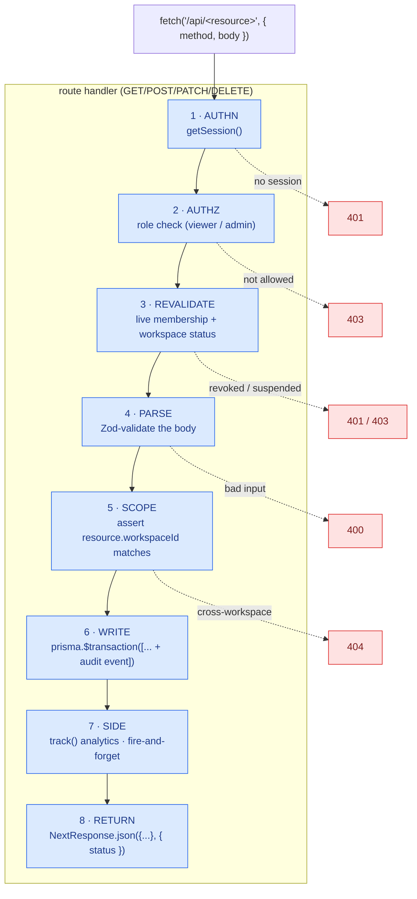

# API Layer - `src/app/api/`

REST route handlers. **Every state-changing operation in the app lives here** (not in
server actions - see the constraint in [README](README.md#the-layered-model)). ~43 route
files, grouped by resource.

## Request lifecycle



The proxy.ts guard has already run for page navigations; API routes re-check the
session themselves since they're hit directly too. Steps 1-5 are centralized in
`withApi` (`src/lib/api-handler.ts`) - see
[known rough edges](#known-rough-edges-improvement-backlog) for the handful of
older routes that still hand-roll them.

## The standard handler shape

```ts
// src/app/api/decisions/reviews/route.ts (representative)
export async function POST(req: NextRequest) {
  const session = await getSession();
  if (!session) return NextResponse.json({ error: "Not authenticated" }, { status: 401 });
  if (isViewer(session.role)) return NextResponse.json(VIEWER_ERROR, { status: 403 });

  const { decisionId, outcomeStatus, ... } = await req.json();
  if (!decisionId) return NextResponse.json({ error: "decisionId required." }, { status: 400 });

  const decision = await prisma.decision.findUnique({ where: { id: decisionId } });
  if (!decision || decision.workspaceId !== session.workspaceId)
    return NextResponse.json({ error: "Decision not found." }, { status: 404 });

  await prisma.$transaction([
    prisma.decisionReview.create({ ... }),
    prisma.decision.update({ ... }),
    prisma.decisionEvent.create({ ... }),   // audit trail
  ]);
  return NextResponse.json({ success: true });
}
```

## Route groups

| Group | Routes | Purpose |
|---|---|---|
| `decisions/` | CRUD, `[id]`, `versions`, `relations`, `reactions`, `supersede`, `archive`, `reviews`, `notes`, `links`, `tags`, `bulk`, `search`, `similar`, `export`, `ai-draft` | The core domain. |
| `action-items/` | list/create, `[id]` | Kanban tasks tied to decisions. |
| `team/`, `settings/`, `settings/sso/`, `tags/`, `templates/` | workspace admin | Membership, config, SSO, tags, templates. |
| `integrations/` | get/put/delete | Slack/Teams/email/Anthropic config (encrypted). |
| `slack/` | `install`, `oauth/callback`, `events`, `actions`, `commands/log`, `connect-user` | Slack capture bot. |
| `auth/sso/[slug]/` | `start`, `callback` | OIDC SSO flow. |
| `notifications/` | list, `send` | In-app + outbound notifications. |
| `cron/` | `review-reminders`, `weekly-digest`, `audit-retention` | Scheduled jobs (bearer-auth). |
| `platform/` | `workspaces`, `workspaces/[id]`, `workspaces/[id]/enter`, `exit` | Provider control plane - **staff-only**, cross-tenant. See below. |
| `health`, `seed` | ops | Liveness probe; dev-only demo seed. |

## Conventions

- **Auth:** `getSession()` ([session.ts](business-logic-layer.md)) then
  `isViewer`/`canWrite`/`isAdmin` from `src/lib/auth-guards.ts`. Reads usually need only a
  session; writes additionally reject viewers; admin-only routes (team, integrations,
  settings) check `isAdmin`.
- **Workspace isolation:** every resource is re-loaded and checked against
  `session.workspaceId`. A valid session from another workspace gets a 404, never data.
- **Platform routes (`platform/*`):** the one deliberate exception to workspace scoping. They use
  `withPlatformApi` (not `withApi`) - a parallel wrapper that requires `session.platformRole` and
  is intentionally cross-tenant. This is the provider control plane; see
  [PLATFORM_ADMIN.md](../PLATFORM_ADMIN.md). Tenant isolation for ordinary routes is unaffected.
- **Validation:** hand-rolled (`.trim()`, length/format checks) - no schema library yet.
- **Errors:** `NextResponse.json({ error }, { status })`. Multi-write routes wrap a
  `try/catch` to translate Prisma unique-constraint errors into friendly 400s.
- **Transactions:** create + audit-event pairs run inside `prisma.$transaction([...])` so a
  partial failure can't orphan rows.
- **Webhooks** (`slack/*`) have **no user session** - they authenticate
  by HMAC signature + timestamp replay window instead, then decrypt stored secrets.
- **Rate limiting:** applied on abuse-prone public/expensive routes (`search`, `similar`,
  `auth/sso/start`, public `share`) via `src/lib/rate-limit.ts`.

## Known rough edges (improvement backlog)

- Most routes now go through `withApi` (`src/lib/api-handler.ts`), which centralizes
  session → role → live-membership revalidation → Zod body validation; a handful of
  older routes (`decisions/search`, `decisions/ai-draft`, the Slack/SSO callbacks)
  still hand-roll the pipeline.
- Shared Zod schemas live in `src/lib/schemas.ts`; a few write routes still validate inline.
- Response envelopes vary (`{ success: true }` vs `{ items }` vs `{ decisions }`).

## Endpoint reference

All routes require a valid session cookie (`session`) except `/api/seed`, the auth/SSO
flows, and the public share page.

### Decisions

| Method | Route | Auth | Body / Params | Description |
|---|---|---|---|---|
| `POST` | `/api/decisions` | member | Decision fields (JSON) | Create a new decision |
| `PUT` | `/api/decisions/:id` | member | Decision fields (JSON) | Update an existing decision |
| `POST` | `/api/decisions/archive` | owner or admin | `{ decisionId }` | Archive a decision (sets status = `archived`) |
| `POST` | `/api/decisions/ask` | any member | `{ question }` | Ask a natural-language question; returns a grounded, cited answer + ranked source decisions (degrades to semantic search with no AI key) |
| `GET` | `/api/decisions/export` | member | - | Download all workspace decisions as CSV |

### Notes

| Method | Route | Auth | Body | Description |
|---|---|---|---|---|
| `POST` | `/api/decisions/notes` | member | `{ decisionId, content }` | Add a note to a decision |
| `DELETE` | `/api/decisions/notes` | author or admin | `{ noteId }` | Delete a note |
| `POST` | `/api/decisions/notes/replies` | member | `{ noteId, content }` | Reply to a note (threaded) |
| `DELETE` | `/api/decisions/notes/replies` | author or admin | `{ replyId }` | Delete a reply |

### Links

| Method | Route | Auth | Body | Description |
|---|---|---|---|---|
| `POST` | `/api/decisions/links` | member | `{ decisionId, label, url, linkType }` | Add a resource link |
| `DELETE` | `/api/decisions/links` | owner or admin | `{ linkId }` | Remove a link |

Link types: `rfc` · `pr` · `adr` · `doc` · `article` · `ticket` · `other`

### Reviews

| Method | Route | Auth | Body | Description |
|---|---|---|---|---|
| `POST` | `/api/decisions/reviews` | member | `{ decisionId, outcomeStatus, summary?, lessonsLearned?, followUpAction? }` | Submit an outcome review |

### Tags

| Method | Route | Auth | Body | Description |
|---|---|---|---|---|
| `POST` | `/api/tags` | **admin** | `{ name, color? }` | Create a workspace tag |
| `DELETE` | `/api/tags` | **admin** | `{ tagId }` | Delete a workspace tag |
| `POST` | `/api/decisions/tags` | member | `{ decisionId, tagId }` | Apply a tag to a decision |
| `DELETE` | `/api/decisions/tags` | member | `{ decisionId, tagId }` | Remove a tag from a decision |

### Team & settings

| Method | Route | Auth | Body | Description |
|---|---|---|---|---|
| `POST` | `/api/team` | **admin** | `{ email, role }` | Invite a member (creates user if none exists) |
| `PUT` | `/api/settings` | **admin** | `{ name, slug }` | Update workspace name and URL slug |

### Platform (provider)

Staff-only routes for the platform control plane - gated by `withPlatformApi` (401 if
unauthenticated, 403 without `platformRole`). Intentionally **not** scoped to a single
workspace. See [Platform admin](../PLATFORM_ADMIN.md).

| Method | Route | Auth | Body | Description |
|---|---|---|---|---|
| `GET` | `/api/platform/workspaces` | **platform** | - | List every company with status and member/decision counts |
| `POST` | `/api/platform/workspaces/:id/enter` | **platform** | - | Enter a company (re-issues the session at that workspace) |
| `POST` | `/api/platform/exit` | **platform** | - | Stop impersonating; return to your home workspace |
| `PATCH` | `/api/platform/workspaces/:id` | **platform** | `{ name?, slug?, status? }` | Rename and/or suspend / reactivate a company |

### Utilities

| Method | Route | Auth | Description |
|---|---|---|---|
| `GET` | `/api/seed` | - | Seed demo workspace (idempotent) |

See [business-logic-layer.md](business-logic-layer.md) for the helpers these handlers call,
and [data-layer.md](data-layer.md) for the Prisma/transaction details.
