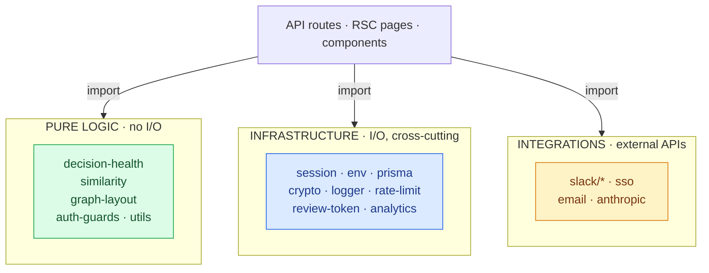

# Business Logic & Infrastructure Layer - `src/lib/` + `src/actions/`

Everything the API and frontend layers depend on but that isn't a route or a component.
Three kinds of module live here: **pure business logic**, **infrastructure**, and
**external integrations**. Named exports only (no default exports) for tree-shaking.



## Pure business logic (no I/O - unit-tested in `tests/smoke/`)

| Module | Responsibility |
|---|---|
| `decision-health.ts` | Classify a decision's health (healthy / review-due / overdue / stale / orphaned / superseded-unreviewed) from its fields. Deterministic; called on render. |
| `similarity.ts` | Jaccard token similarity for "did you mean / re-decide?" duplicate detection. |
| `graph-layout.ts` | Deterministic force-directed layout for the decision graph canvas. |
| `auth-guards.ts` | `isViewer` / `canWrite` / `isAdmin` role predicates + `VIEWER_ERROR`. |
| `utils.ts` | Shared formatting/label helpers (status labels, etc.). |

These are pure functions: same input → same output, no DB/network. That's why they each
have a smoke-test suite and can run in `runLayout`-style determinism checks.

## Infrastructure (cross-cutting, does I/O)

| Module | Responsibility | Notes |
|---|---|---|
| `env.ts` | **Single validated config source.** `getSessionSecret/Key`, `getDatabaseUrl`, `isProduction`. | Throws in prod if `SESSION_SECRET` (<32) or `DATABASE_URL` missing; dev defaults otherwise. |
| `session.ts` | JWT session create/verify/delete (jose, HS256) in an httpOnly cookie. | 7-day expiry; key from `env.ts`. `import "server-only"`. |
| `review-token.ts` | Signed one-click magic-link tokens for email review actions. | Same secret as sessions. |
| `crypto.ts` | AES-256-GCM encrypt/decrypt for stored integration secrets. | Per-record random salt; backward-compatible with legacy fixed-salt ciphertext. |
| `prisma.ts` | Prisma client singleton + driver-adapter selection. | See [data-layer.md](data-layer.md). |
| `rate-limit.ts` | Token/fixed-window limiter; Redis backend (`REDIS_URL`) or in-memory. | `check()` is async. |
| `logger.ts` | Structured JSON logger (prod) / pretty (dev). | Replaces scattered `console.*`. |
| `analytics.ts` | First-party event writes to `AnalyticsEvent`. | Fire-and-forget; never throws into a request. |

## External integrations

| Module | Talks to | Security |
|---|---|---|
| `slack/verify.ts` | - | HMAC signature + 5-min replay window (timing-safe compare). |
| `slack/client.ts` | Slack Web API | fetch wrapper; outbound calls are best-effort (Slack's 3s deadline). |
| `slack/workspace.ts` | DB | Resolves linked Slack ↔ DecisionOS workspace/user; decrypts bot token. |
| `slack/modal.ts` | - | Builds Block Kit modals; extracts submitted values. |
| `sso.ts` | OIDC IdP | Discovery doc cache, token exchange, JWKS verify (issuer/audience/nonce). |
| `email.ts` | SMTP (nodemailer) | Degrades gracefully if `SMTP_*` unset; logs via `logger`. |

## `src/actions/` - the one allowed server-action home

Server actions are **banned inside `src/app/(app)/`** (Turbopack 16.2.x misroutes action
IDs). Auth actions (`src/actions/auth.ts`: login, signup, logout) live here, *outside* the
app layout, where the bug doesn't apply. Everything else mutates via the API layer.

## How a typical write uses this layer

```
POST /api/decisions/reviews
   ├─ session.ts        getSession()           → who & which workspace
   ├─ auth-guards.ts    isViewer()             → may they write?
   ├─ prisma.ts         $transaction([...])    → persist + audit event
   └─ analytics.ts      track("decision.reviewed")  (fire-and-forget)
```

Tested behavior for the pure modules is in `tests/smoke/` and registered in
`tests/smoke/run.ts` (slack-hmac, rate-limit, plans, decision-health, similarity,
graph-layout, crypto).
