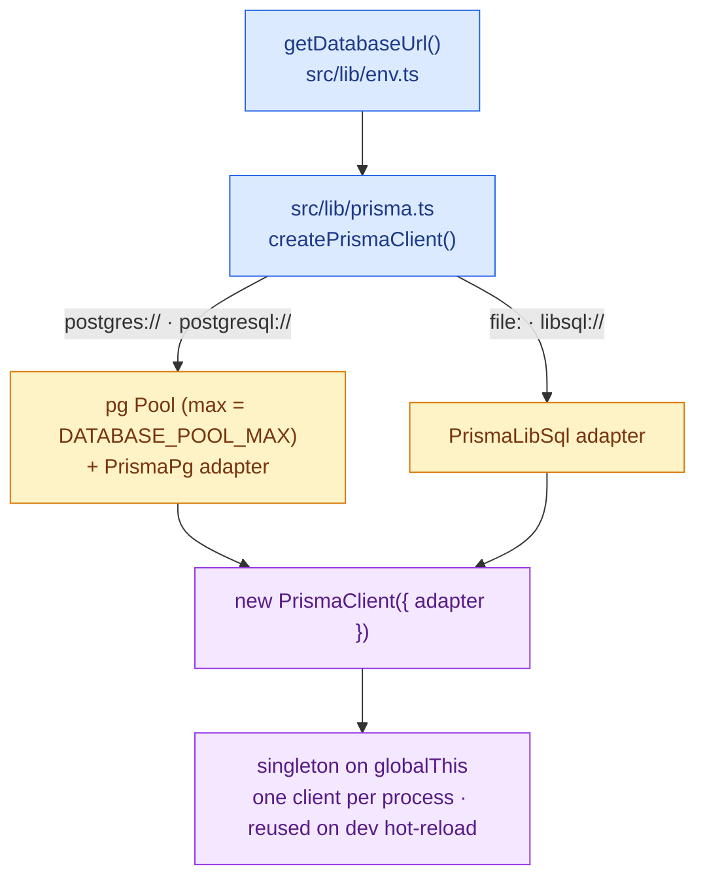
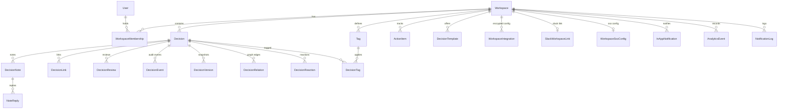

# Data Layer - `src/lib/prisma.ts` + `prisma/`

Prisma v7 with **driver adapters**. The client is generated into `src/generated/prisma`
(not `@prisma/client`) and instantiated as a singleton.

## Client construction & adapter selection



```ts
// shape of src/lib/prisma.ts
const url = getDatabaseUrl();
if (url.startsWith("postgres")) { /* pg Pool + PrismaPg */ }
else                            { /* PrismaLibSql (file:/libsql:) */ }
export const prisma = globalForPrisma.prisma ?? createPrismaClient();
```

## ⚠️ Prisma v7 is provider-locked - important

The **generated client is tied to the schema's `provider`**. The schema is now
`provider = "postgresql"`, so at runtime Prisma **rejects a SQLite/libsql adapter**:

```
The Driver Adapter `@prisma/adapter-libsql`, based on `sqlite`,
is not compatible with the provider `postgres` specified in the Prisma schema.
```

Consequences (and how the repo handles it):
- The `file:`/libsql branch in `prisma.ts` only works when the client was generated against a
  **`sqlite`** schema. The committed schema is Postgres, so the client must be regenerated for
  SQLite to use `dev.db` locally - you cannot serve both providers from one generated client.
- This is automated: **`npm run dev`** runs a `predev` hook (`scripts/dev-db.mjs`) that derives a
  SQLite copy of the committed Postgres schema, regenerates the client for SQLite, and syncs
  `dev.db`. So local dev "just works" on SQLite while production stays Postgres. The committed
  `prisma/schema.prisma` is never modified; the derived `prisma/dev-sqlite.prisma` is gitignored.
- Prefer Postgres locally (prod-accurate)? Set a `postgres://` `DATABASE_URL` (e.g.
  `docker compose up -d`); the `predev` hook then no-ops and the committed schema is used directly.
- Production/Docker builds run `prisma generate` against the Postgres schema as normal - the
  `predev` hook only runs for `npm run dev`, so the two never collide.

## Schema & models - `prisma/schema.prisma`

23 models. Core graph:



Modeling notes:
- **Enums are stored as `String`** (status, role, category, priority, relationType, …) with
  app-level defaults - no DB-level CHECK yet. Moving to Postgres-native `enum` is a backlog item.
- **JSON is stored as `String`** (`consultedIds`, `*Json` audit/version blobs, encrypted
  `configJson`). Postgres `jsonb` is a future improvement.
- **Audit trail:** most mutations also write a `DecisionEvent`; edits snapshot to
  `DecisionVersion`. These are created in the same `$transaction` as the change.

## Indexes

Hot-path `@@index`es were added for cloud scale (cron and list queries previously full-scanned):

- `Decision`: `workspaceId`, `[workspaceId, status]`, `reviewDate`, `ownerUserId`, `updatedAt`
- child tables (`DecisionNote/Link/Review/Event/Version`): `decisionId` (+ `userId` where queried)
- `DecisionRelation`: `fromDecisionId`, `toDecisionId`
- `ActionItem`: `workspaceId`, `assigneeId`, `[workspaceId, status]`
- `InAppNotification`: `[userId, isRead]`

## Migrations

- `prisma/migrations/<ts>_init/migration.sql` - Postgres baseline covering **all 23 models**
  (23 tables, 21 indexes, 35 FKs). `migration_lock.toml` provider = `postgresql`.
- Applied with `prisma migrate deploy` (runs automatically on container start via the
  Dockerfile `CMD` in the lean ECS deployment).
- The migration was generated with `prisma migrate diff --from-empty --to-schema` (no live DB
  needed), so it's deterministic from the schema.

## Transactions & access patterns

- Multi-write operations use `prisma.$transaction([...])` (reviews, notes, archive, supersede)
  so the change and its audit event commit together.
- Reads are workspace-scoped: queries filter by `session.workspaceId` (enforced in the API layer).
- Connection pooling: `pg` Pool `max` defaults to 5 per instance; put a pooler (RDS Proxy /
  PgBouncer) in front for high fan-out - see [deploy docs](https://github.com/shafaypro/DecisionOS/blob/main/deploy/aws-ecs/docs/ARCHITECTURE.md).

## Field reference (core models)

How the models relate is shown in the [core graph above](#schema--models---prismaschemaprisma);
this section lists the fields that matter most per model.

### Workspace (selected)

| Field | Type | Description |
|---|---|---|
| `status` | String | `active` / `suspended` - lifecycle set by the platform console; suspended workspaces lock out their members (see [Platform admin](../PLATFORM_ADMIN.md)) |

### Decision

| Field | Type | Description |
|---|---|---|
| `title` | String | Short decision title (3-200 chars) |
| `summary` | String| 1-2 sentence description shown in list views (max 500) |
| `category` | String | `engineering` / `product` / `hiring` / `finance` / `marketing` / `operations` / `strategy` / `other` |
| `status` | String | `draft` / `in_review` / `approved` / `superseded` / `deprecated` / `reversed` / `archived` |
| `outcomeStatus` | String| `unknown` / `successful` / `partially_successful` / `unsuccessful` / `reversed` |
| `impactLevel` | String | `low` / `medium` / `high` / `critical` |
| `visibility` | String | `workspace` (all members) / `private` (creator only) |
| `ownerUserId` | String| Responsible person (FK → User) |
| `problemStatement` | String| What problem prompted this decision? |
| `chosenOption` | String| What specific option was selected? |
| `rationale` | String| Why was this option chosen? |
| `alternativesConsidered` | String| What other options were evaluated? |
| `assumptions` | String| Conditions that must hold for this to work |
| `risks` | String| Known failure modes and downsides |
| `decisionDate` | DateTime | When the decision was made |
| `reviewDate` | DateTime | When to revisit the decision |
| `reviewedAt` | DateTime | When the first review was submitted |

### Tag

| Field | Type | Description |
|---|---|---|
| `name` | String | Tag label (unique per workspace, max 50 chars) |
| `color` | String| Hex colour (e.g. `#6366f1`) used for badge rendering |

### DecisionReview

| Field | Type | Description |
|---|---|---|
| `outcomeStatus` | String | `successful` / `partially_successful` / `unsuccessful` / `reversed` |
| `summary` | String| What actually happened |
| `lessonsLearned` | String| What would you do differently? |
| `followUpAction` | String| Follow-on decisions or actions required |

### DecisionEvent types (audit log)

`created` · `updated` · `status_changed` · `note_added` · `link_added` · `reviewed`
