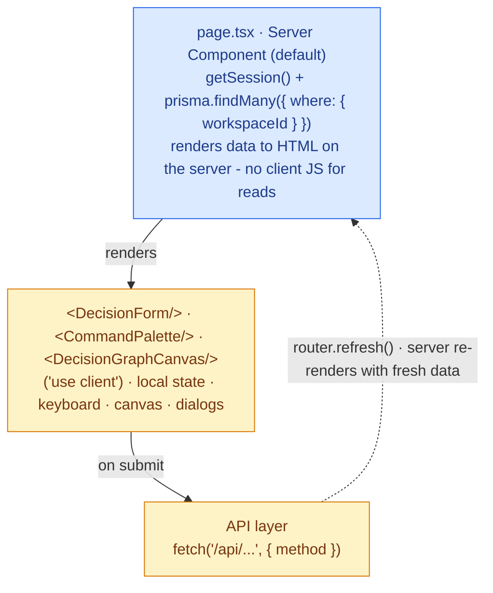
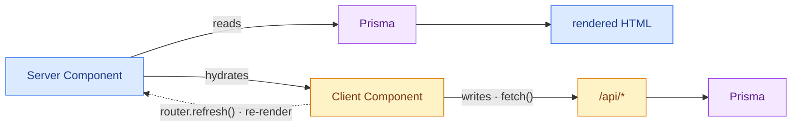

# Frontend Layer - `src/app/**` + `src/components/**`

Next.js 16 App Router. Default to **React Server Components**; `"use client"` only where a
component needs browser APIs, state, or event handlers.

## Route structure

```
src/app/
├── (app)/                  ← PROTECTED group (session required, guarded by proxy.ts)
│   ├── dashboard, decisions (+ [id], new, edit, history), board, graph,
│   │   reviews, my-work, analytics, tags, team,
│   │   settings (+ audit, integrations, sso, templates), slack/connect
│   └── layout.tsx          ← app shell: sidebar, top bar; loads session once
├── login/  signup/         ← PUBLIC auth pages (use src/actions/auth.ts server actions)
├── share/[id]/             ← PUBLIC read-only shared decision (rate-limited)
├── page.tsx                ← PUBLIC marketing landing
└── api/                    ← the API layer (see api-layer.md)
```

`src/proxy.ts` decides public vs protected (Next 16 replaces `middleware.ts`). Pages in
`(app)/` assume a valid session.

## Server vs client components



- **Reads** happen in Server Components, which query Prisma directly - fast, no client
  round-trip, naturally workspace-scoped.
- **Writes** happen in client components via `fetch()` to API routes (never server actions
  inside `(app)/`). After a successful write they `router.refresh()` or update local state.

## Component taxonomy - `src/components/`

| Folder | What | Client? |
|---|---|---|
| `ui/` | Primitives: `button`, `card`, `badge`, `input`, `select`, `avatar`, `toast`, `skeleton`, `logo`, `shortcuts-overlay`, … | mostly leaf; some client |
| `layout/` | App shell: `app-shell`, `sidebar`, `top-bar`, `breadcrumbs`, `account-block`, `page-header` | client (interactive nav/drawer) |
| `decisions/` | `decision-form`, `ai-draft-button`, `similar-decisions-hint` | client |
| `graph/` | `decision-graph-canvas` (uses `lib/graph-layout`) | client (canvas) |
| `search/` | `command-palette` (⌘K) | client |
| `reviews/` | `inline-review-buttons` | client |
| `notifications/` | `notification-bell` | client |

`ui/` primitives are built on Radix UI + Tailwind v4 with `class-variance-authority`. Each
primitive has a Storybook story (`*.stories.tsx`) for isolated development.

## Design system

Brand tokens (colors, typography) live in `globals.css`; shared `<LogoMark/>` / `<Wordmark/>`
in `ui/logo`. Tailwind utility classes are preferred over custom CSS. Loading states use the
`skeleton` primitive; transient feedback uses `toast`.

## Data flow summary



This split keeps the read path cheap (server-rendered, no API hop) while routing every
mutation through the validated, workspace-scoped [API layer](api-layer.md).

## Page directory

| Route | Description |
|---|---|
| `/dashboard` | Workspace health - decision debt pill, stats cards, recent activity feed, overdue reviews |
| `/decisions` | Full decision list with search, multi-filter sidebar, and onboarding checklist |
| `/decisions/new` | Create a new decision - full structured form with template picker and re-decide detector |
| `/decisions/:id` | Decision detail - all fields, health badge, blast radius, reactions, notes, links, tags, version history, reviews, audit trail |
| `/decisions/:id/edit` | Edit all decision fields (snapshots a version before saving) |
| `/decisions/:id/history` | Full field-diff timeline - before/after for every edit |
| `/board` | Kanban board - decisions grouped by status, with per-card move/delete actions |
| `/my-work` | Everything assigned to or owned by you - decisions and action items in one place |
| `/activity` | Workspace activity feed with event-type filtering |
| `/ask` | **Ask DecisionOS** - ask your decision history in plain English; grounded, cited answers with clickable sources |
| `/graph` | Interactive decision graph - force-directed canvas with pan/zoom/drag and edge-type legend |
| `/reviews` | Workspace-wide reviews hub - overdue, upcoming, recent |
| `/analytics` | Decision patterns by category - reversal rate and health rate per category |
| `/tags` | Tag management (admins create/delete; all members apply) |
| `/team` | Member roster + invite form (admin) |
| `/settings` | Workspace name and slug settings (admin) |
| `/settings/templates` | Decision template management - create/edit reusable intake templates (admin) |
| `/settings/audit` | Workspace security audit log viewer - immutable, filterable trail |
| `/settings/sso` | OIDC SSO configuration - issuer, client ID/secret, email domain, enforce SSO |
| `/settings/integrations` | Slack install, Anthropic API key, per-workspace integration config |
| `/admin` | **Platform staff only** - provider console listing every company; enter, rename, or suspend / reactivate a workspace (see [Platform admin](../PLATFORM_ADMIN.md)) |
| `/share/:id` | **Public** read-only view of a workspace-visible decision - no login required |
| `/api/decisions/export` | Triggers CSV file download of all workspace decisions |
