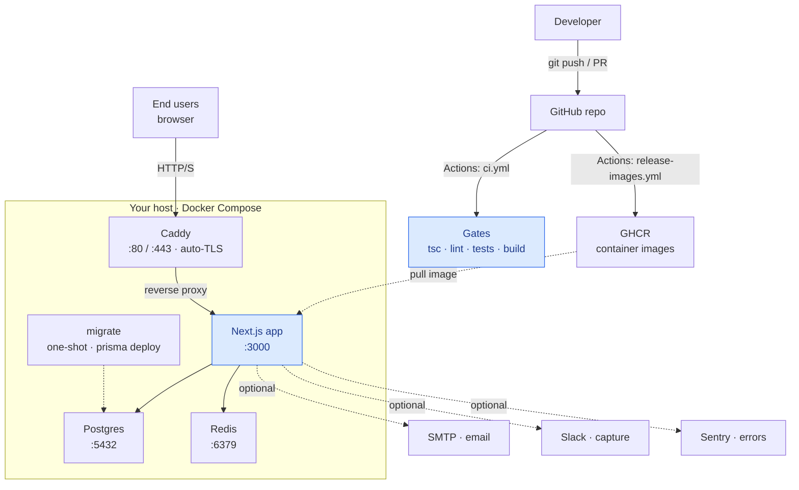

# Architecture

The whole system at a glance, then a guide to each part. DecisionOS runs as a
single Docker Compose stack (Postgres + Redis + app + Caddy) you can host
anywhere. CI/CD is **GitHub Actions**: it tests every change and publishes
container images to **GHCR**; your host only pulls - nothing builds on the box.

---

## Guide

### 1. Build and ship (the accent boxes)

Every push and pull request runs **GitHub Actions**:

1. **`ci.yml`** runs the quality gates - `tsc --noEmit`, lint, smoke + integration
   tests, and a production build. A failing gate blocks the merge.
2. When a release is published (or a `v*` tag is pushed), **`release-images.yml`**
   builds the two Docker images (the slim `runner` and the one-shot `migrator`)
   and pushes them to **GHCR** (GitHub Container Registry).
3. Your host **pulls the images** and rolls the stack with `docker compose`. The
   `migrate` one-shot runs `prisma migrate deploy` before the app starts, so the
   schema is always current. Nothing builds on the host.

The workflows live in [`.github/workflows/`](../../.github/workflows/). On a public
repo, GitHub Actions minutes are free.

### 2. Runtime (the EC2 box)

One `t3.micro` in `eu-west-1` runs everything via Docker Compose:

- **Caddy** terminates `:80` / `:443` and reverse-proxies to the app. (TLS is
  wired but only activates once a domain is set; today the site is HTTP-only on
  the Elastic IP.)
- **Next.js app** (`:3000`) is the product: decisions, reviews, the `/admin`
  platform console, GDPR controls, and the audit feed.
- **Postgres** (`:5432`) is the database; **Redis** (`:6379`) backs rate limiting.
- **migrate** is a one-shot container that applies Prisma migrations before the
  app starts, so serving replicas never race on migrations.

Data volumes (`pgdata`, Caddy certs) persist across deploys. Details and the
bootstrap history: [AWS EC2 runbook](AWS_EC2_DEPLOYMENT_RUNBOOK.md).

### 3. AWS managed services

- **Secrets Manager** holds the EC2 SSH key and the GitHub source token; CodeBuild
  reads them at deploy time. Nothing durable is stored in GitHub.
- **CloudWatch Logs** receives the app and Caddy logs via the Docker `awslogs`
  driver (group `/decisionos/app`, 30-day retention).
- An **IAM instance role** lets the box pull from ECR and write logs, with no
  long-lived AWS keys on the machine.

### 4. A request, end to end

Browser → Elastic IP → Caddy (`:443`) → Next.js app (`:3000`). The app reads and
writes Postgres, uses Redis for rate-limit checks, and emits structured JSON logs
that flow to CloudWatch. Auth is an encrypted session cookie; the edge guard lives
in `src/proxy.ts`.

### 5. Third-party integrations (optional)

Enabled per workspace or per environment: **SMTP** (review reminders and
digests), **Slack** (decision capture), and **Sentry** (error reporting). All are
off by default and degrade gracefully when unset.

---

## Notes vs. the diagram

- **TLS** is handled by Caddy (auto-TLS) once a domain is configured; without one
  the site serves over HTTP on the host's IP.
- **CI/CD is GitHub Actions.** On a public repo, Actions minutes are free - CI
  runs on every push/PR with no extra setup.

## See also

- [AWS EC2 runbook](AWS_EC2_DEPLOYMENT_RUNBOOK.md) - self-hosting on a single box, plus operations.
- [Deployment targets](README.md) - compare Compose, EC2, GCP, ECS, and Kubernetes.
- [GDPR](../compliance/GDPR.md) - data processing and the data-subject rights.
